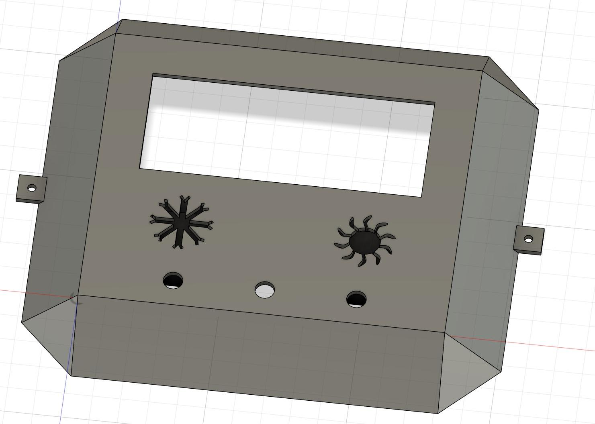

# Maison à basse consommation — maquette de régulation thermique

Maquette de démonstration d'une habitation sobre en énergie : une petite maison en bois dont la température intérieure est pilotée par une carte Arduino Mega, avec deux modes (hiver et été) qui simulent les conditions extérieures.


*La maison posée sur sa base, qui contient l'alimentation et l'électronique.*

## Objectif et contexte

Le bâtiment représente une part importante de la consommation d'énergie. Le projet consistait à construire une maquette qui montre, à petite échelle, comment des leviers simples (volet automatique, chauffage piloté, circulation d'air) permettent de tenir une température de consigne.

- **Cadre** : projet d'instrumentation de deuxième année du cycle ingénieur, spécialité Instrumentation et Systèmes Embarqués, Sup Galilée (Université Sorbonne Paris Nord), année 2024–2025.
- **Équipe** : groupe de quatre étudiants, encadré par un enseignant-chercheur.
- **Grandeur régulée** : la température intérieure, avec une plage visée de 21 à 23 °C.

## État du projet

Maquette construite, câblée et présentée en mai 2025. Les composants ont été testés un par un et le programme d'intégration fonctionne. En revanche, la régulation complète n'a pas pu être validée par des essais : le montage électrique final a été terminé trop tard (voir « Essais et résultats »).

## Ma contribution

Travail réalisé à quatre. D'après la répartition des tâches du rapport, j'ai pris en charge :

- le **volet roulant** : découpe, pose et programmation de sa commande par moteur pas à pas ;
- la pose du capteur de température et de la résistance chauffante ;
- une partie du câblage, de l'assemblage et de la peinture de la maison ;
- avec le reste du groupe, le programme général été/hiver.

La façade de contrôle, la lampe, le module Peltier, la conception 3D et l'asservissement de la résistance ont été menés par les autres membres.

## Matériel et technologies

| Élément | Détail |
|---|---|
| Carte | Arduino Mega |
| Capteur | Température TCN75A en I2C (adresse 0x48) |
| Chauffage intérieur | Résistance chauffante commandée en PWM |
| « Soleil » | Ampoule halogène 100 W commandée en PWM, inclinable par servomoteur |
| Froid extérieur | Module Peltier commandé en PWM |
| Circulation d'air | Ventilateurs dans la maison et dans la base |
| Volet | Enrouleur imprimé en 3D, entraîné par un moteur pas à pas |
| Interface | Écran LCD I2C 20×4 (adresse 0x27), boutons hiver et été, LED de mode, potentiomètre |
| Puissance | Étages à MOSFET, alimentation dédiée logée dans la base |
| Logiciels | IDE Arduino (C++), Fusion 360 pour les pièces imprimées |
| Bibliothèques | `Wire`, `LiquidCrystal_I2C`, `CheapStepper`, et `TCN75A` (fichiers fournis dans le dossier du programme) |


*Schéma de principe de la commande en PWM des charges de puissance par MOSFET.*

## Fonctionnement prévu

Deux boutons sur la façade choisissent le mode.

**Mode hiver.** Le module Peltier refroidit l'extérieur simulé (intensité réglable au potentiomètre) et la lampe est faible et basse. La résistance chauffe l'intérieur. Sous 21 °C le volet s'ouvre, au-dessus de 23 °C il se ferme. Une régulation PI sur la résistance doit maintenir la consigne.

**Mode été.** La lampe est forte et haute. Au-dessus de 21 °C le volet se ferme pour limiter les apports ; en dessous il s'ouvre. Une plaque noire interchangeable sur le mur du fond permet de comparer l'effet d'un mur sombre et d'un mur clair.

L'écran affiche la température et une LED indique le mode actif.


*Façade de contrôle imprimée en 3D : écran, boutons hiver et été, potentiomètre.*

## Ce que fait le code de ce dépôt

`Projet_Maison_Energetique.ino` est le programme d'intégration :

- lecture des boutons hiver et été, allumage de la LED correspondante ;
- commande en PWM de la résistance, de la lampe, du Peltier et des ventilateurs, avec des valeurs fixes selon le mode ;
- lecture du capteur TCN75A et affichage de la température sur l'écran LCD et sur le port série ;
- fonction de descente puis remontée du volet par le moteur pas à pas ;
- fonctions de test pour chaque composant (capteur, moteur, Peltier, résistance, lampe, ventilateur, LCD, LED, boutons, potentiomètre).

La régulation PI et l'ouverture du volet selon les seuils de 21 et 23 °C sont décrites dans le rapport mais **ne sont pas implémentées dans cette version du code**.


*Enrouleur du volet entraîné par le moteur pas à pas, en test sur table.*

## Organisation du dépôt

```
arduino/Projet_Maison_Energetique/   Programme d'intégration et pilote du capteur TCN75A
arduino/peltier/                     Essai du module Peltier
arduino/moteur_pas_a_pas_test/       Essai du moteur pas à pas
arduino/stepper_turning/             Essai de rotation du moteur pas à pas
arduino/Test_temperature_sensor/     Essai du capteur de température
cad/                                 Fichiers Fusion 360 (enrouleur du volet, coffret)
assets/                              Photos de la maquette, vues 3D et schéma
```

## Installation et utilisation

1. Installer l'IDE Arduino, puis les bibliothèques `LiquidCrystal I2C` et `CheapStepper` depuis le gestionnaire de bibliothèques.
2. Ouvrir `arduino/Projet_Maison_Energetique/` ; les fichiers `TCN75A.h` et `TCN75A.cpp` doivent rester dans ce dossier.
3. Sélectionner la carte Arduino Mega et le port, puis téléverser.
4. Appuyer sur le bouton hiver ou été de la façade.

Brochage (d'après le code) : Peltier 12, résistance 11, lampe 10, ventilateur 13, servomoteur de la lampe 4, boutons 2 et 3, LED 50 et 37, potentiomètre A0, moteur pas à pas 32/28/30/22, capteur et écran sur le bus I2C.

> La compilation et le téléversement n'ont pas été rejoués lors de la mise en forme de ce dépôt. Le croquis `Test_temperature_sensor` peut nécessiter une copie des fichiers `TCN75A` dans son dossier.

## Essais et résultats

- Chaque composant a été essayé séparément avec les croquis de test.
- **Aucune mesure de régulation en conditions réelles n'a été faite.** Le rapport le précise : les tableaux de température qu'il contient (modes été et hiver, avec et sans PI) sont des **données simulées**, produites pour illustrer le comportement attendu. Ils ne sont pas repris ici comme des résultats.
- Analyse retenue pour le chauffage : un correcteur PI, sans terme dérivé, le système thermique étant lent et le capteur bruité.

## Limites

- Régulation PI et logique de seuils du volet non implémentées dans le code disponible.
- Dimensionnement de la partie puissance fait tardivement, sans calcul préalable des puissances dissipées (composants et MOSFET).
- Isolation de la maquette éloignée d'un bâtiment réel ; constantes de temps très différentes.
- Montage final câblé avant d'avoir été testé sur table, ce qui a retardé la mise au point.
- Pistes notées par l'équipe : capteur de température dans la base, amélioration de l'isolation, panneaux solaires, mesure de luminosité et d'humidité.

## Photos et conception

| | |
|---|---|
|  |  |
| *Structure en bois en cours d'assemblage* | *Intérieur de la base : alimentation, ventilateur et carte* |
|  |  |
| *Façade de contrôle, vue Fusion 360* | *Enrouleur du volet, vue Fusion 360* |

## Crédits

Projet réalisé par un groupe de quatre étudiants de Sup Galilée. L'origine des fichiers `TCN75A.h` et `TCN75A.cpp` (pilote du capteur) est à préciser.

## Licence

Aucune licence n'a été définie pour ce travail d'équipe.
