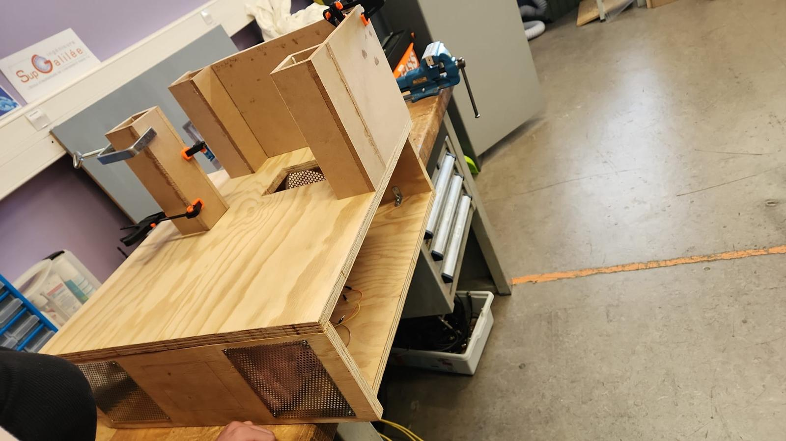

# Low-Energy House Demonstrator

Arduino Mega demonstrator of temperature management in a model house. A heater, ventilation and a motorised shutter respond to summer and winter scenarios, with a halogen lamp and Peltier module simulating outdoor conditions.

## Repository guide

| Location | Contents |
|---|---|
| [arduino/](arduino/) | Integrated sketch, sensor driver and component experiments |
| [documentation/](documentation/) | Project report and poster |
| [cad/](cad/) | Fusion 360 enclosure and shutter models |
| [assets/](assets/) | Assembly, wiring and hardware photographs |
| [tests/](tests/) | Host tests with Arduino interface stubs |

## Getting started

Open `arduino/Projet_Maison_Energetique/Projet_Maison_Energetique.ino` in the Arduino IDE and use the Mega board configuration. Install the libraries referenced by the sketch. Host checks are available through `make test`.

## Project context

Four-student instrumentation project. Tedj contributed to the shutter, sensor and heater installation, wiring and assembly. Component operation was studied; complete thermal regulation remains to be validated on the prototype.
