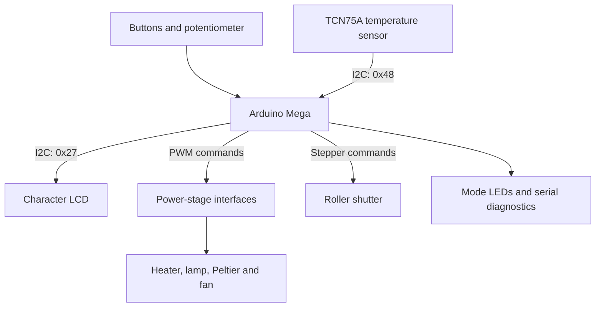
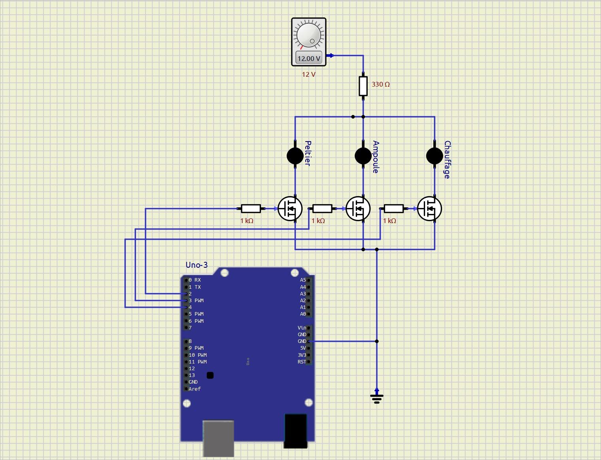
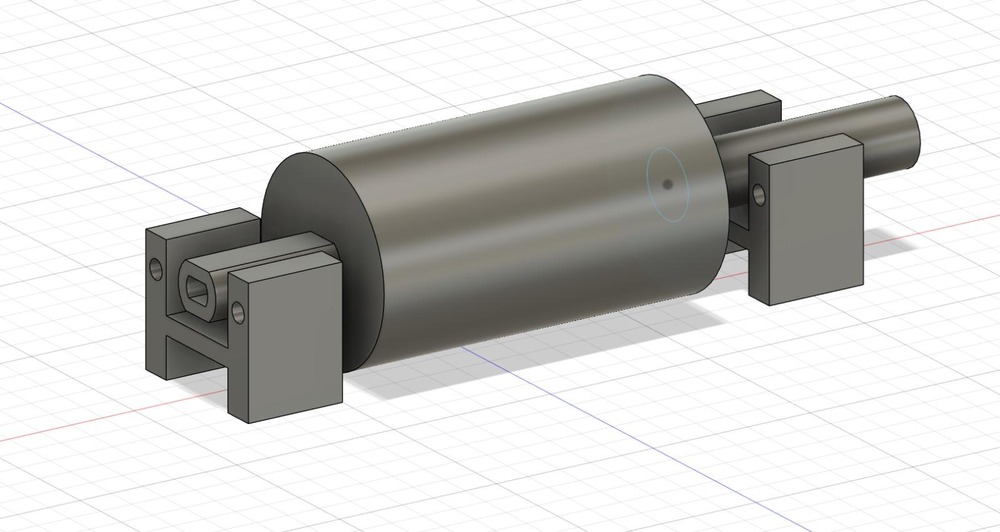

# Low-Energy House — Embedded Thermal Demonstrator

Arduino thermal demonstrator integrating temperature sensing, PWM loads and a motorised shutter.

**Arduino C/C++ · I²C · PWM · Stepper Motors · Temperature Acquisition · Power Electronics · Mechanical Integration**


*The physical demonstrator: wooden house model mounted above the electronics and power-supply enclosure.*

## Project Overview

| Item | Details |
|---|---|
| Context | Second-year engineering instrumentation project, Sup Galilée, Université Sorbonne Paris Nord |
| Team | Greg Alberts, Sarah Dahmoun, Hugo Lebaud and Tedj El Moulk Sinacer |
| Supervisor | Gabriel Dutier |
| Controller | Arduino Mega |
| Intended temperature range | 21–23 °C |
| Environmental simulation | Halogen lamp for heating; Peltier module for cooling |
| Status | Model assembled and wired; individual components tested; full thermal regulation not experimentally validated |

The project integrates embedded software, sensors, electromechanical actuation, power-stage design and mechanical construction. The available firmware is an integration/test version. It does not implement the complete autonomous regulation described in the report and poster.

## My Contribution

According to the task allocation in the project report, I worked on:

- cutting, fitting and programming the motorized roller shutter;
- installing the temperature sensor and heating element with teammates;
- wiring, assembly and painting of the physical model;
- developing the summer/winter integration program jointly with the team.

Other team members led the control-panel design, halogen-lamp subsystem, Peltier subsystem, CAD work and heater-control study.


*Bench integration of the shutter winding mechanism and stepper motor.*

## Design Objectives and Implemented Scope

| Subsystem | Intended design | Preserved implementation |
|---|---|---|
| Temperature acquisition | Measure indoor temperature for control feedback | TCN75A readings displayed on LCD and serial output |
| Heating | Regulate the heating element around a setpoint | Fixed PWM commands selected by button conditions |
| Cooling | Simulate winter conditions with a Peltier module | Test function available; calls disabled in the main loop |
| Solar influence | Modulate lamp intensity and orientation | Lamp PWM commands present; servo signal pin declared but no servo-control code |
| Ventilation | Distribute air and manage heat dissipation | Fan output commanded to its maximum PWM value in both mode branches |
| Shutter | Open/close according to temperature and season | Movement routines present; temperature-triggered routine is not reached in the current control flow |
| Regulation | PI/PID study and 21–23 °C target range | No closed-loop PI/PID controller implemented |
| User controls | Select summer/winter scenarios | Active-low buttons and mode LEDs |

The report includes illustrative thermal data. Those tables are explicitly simulated; they are not measurements from the demonstrator.

## System Architecture



The power loads are distinct from the logic-level control signals. The report discusses MOSFET switching and power dissipation as integration challenges.



*Power-stage schematic retained from the original project material.*

## Hardware Interfaces

Pin assignments below are taken from the integration sketch.

| Function | Pin / interface |
|---|---|
| Peltier command | PWM pin 12 |
| Heating-element command | PWM pin 11 |
| Halogen-lamp command | PWM pin 10 |
| Fan command | PWM pin 13 |
| Lamp-servo signal | Pin 4, declared but not controlled |
| Winter / summer buttons | Pins 2 / 3, `INPUT_PULLUP`, active LOW |
| Winter / summer LEDs | Pins 50 / 37 |
| Potentiometer | Analog channel 0; read by a test function |
| Shutter stepper | Pins 32, 28, 30, 22 |
| Temperature sensor | TCN75A, I²C address `0x48` |
| LCD | I²C address `0x27`, configured as 20 columns × 4 rows |
| Serial diagnostics | 9600 baud |

The report describes a 100 W halogen lamp. Load current, supply capacity and MOSFET dissipation connect that component choice to the power-stage design; these values should be calculated for the actual fitted hardware.

## Temperature Acquisition and TCN75A Driver

The bundled driver uses Arduino's `Wire` API. Its temperature-read path:

1. addresses the sensor at `0x48`;
2. writes the temperature-register pointer `0x00`;
3. calls `endTransmission(false)` to retain the bus for the subsequent read;
4. requests two bytes;
5. interprets the first byte as a signed integer component;
6. extracts the high nibble of the second byte as a fractional component;
7. returns a floating-point temperature value.

The driver also exposes configuration-register, resolution, shutdown, alert-mode and threshold methods.

| Register pointer used by the driver | Purpose |
|---|---|
| `0x00` | Temperature readout |
| `0x01` | Configuration |
| `0x02` | Hysteresis threshold |
| `0x03` | Upper threshold |

The application calls `begin()` but does not explicitly configure conversion resolution or alert thresholds.

### Driver Review

Both `readTemperature()` and `getTemp()` declare an array with one element and then access `data[1]`. This is an out-of-bounds access and needs correction before relying on the readings.

The implementation also does not verify the I²C transaction status or received byte count. Temperature decoding should be checked against the sensor documentation and tested with known positive and negative encoded values after the buffer issue is corrected.

The header references [FaultyTwo's TCN75A Arduino library](https://github.com/FaultyTwo/TCN75A-arduino-lib). The bundled driver should be treated as referenced third-party code; no original-driver authorship is claimed here.

## PWM Commands and Actual Mode Behaviour

The integration sketch sends integer values through `analogWrite()`. These are command values on the 0–255 scale, not percentages.

| Button condition | Heater | Lamp | Fan | Peltier |
|---|---|---|---|---|
| Summer button LOW | 100 | 50 | 255 | Test call commented out |
| Winter button LOW | 0 | 0 | 255 | Test call commented out |
| Neither button LOW | No new command | No new command | No new command | No new command |

For interpretation, 100/255 is approximately 39.2% and 50/255 approximately 19.6% of the command scale. These ratios do not establish measured thermal power.

The summer branch has priority if both buttons are LOW. There is no persistent mode-state variable or software debounce in the current sketch; previously commanded outputs remain until another command changes them.

The winter branch disabling the heater differs from the intended winter-heating strategy. This behaviour is documented as stored, rather than presented as a validated regulation policy.

The generic `fonctionProjet_PWM()` dispatcher compares string pointers using `==`. A future implementation should use an enum or an explicit string-content comparison.

## Motorized Shutter

The shutter is controlled through `CheapStepper` on four GPIO pins. The project includes standalone movement tests and a down/up routine in the integration sketch.

The routine commands `4096 × 2 = 8192` steps in one direction, waits 2 s, commands the same count in the opposite direction and waits another 2 s.

The exact step count per mechanical rotation and resulting shutter travel need calibration; comments and configured counts are not fully consistent.

### Current Trigger Condition

The temperature routine calls the shutter sequence only when:

```c
compteur == 1 && t > 32.0
```

However, `compteur` is initialized to zero and is not set to one anywhere in the available integration sketch. The movement branch is therefore unreachable in its current form.

The 32 °C test condition also differs from the intended 21–23 °C seasonal strategy. The code does not implement shutter homing, physical position feedback or end-stop handling.

## Thermal-Control Study

The report discusses a thermal model using temperature, injected heater power, thermal gain and a thermal time constant. It proposes PI control for the slow thermal system, with an intended setpoint of 23 °C in the illustrated winter scenario.

The proportional term would respond to temperature error and the integral term would compensate persistent error. The report discusses limiting derivative action because of measurement noise and the slow process dynamics.

The PI work is the control-design part of the report. Moving from that study to the firmware requires process identification, a sampling period, tuned gains and saturation/anti-windup rules; the integration sketch currently exercises actuator commands directly.

The small model's thermal mass, insulation and time constants differ from a full-size building. No building-scale energy-saving performance is inferred from the prototype.

## Application Timing and Diagnostics

The temperature routine performs two 500 ms delays, giving at least approximately 1 s of blocking wait per loop, before I²C and output overhead.

Temperature and a counter value are written to the LCD, then the display is cleared. The same readings are printed over the serial connection.

Stepper movement, when called, also uses blocking loops and delays. There is no RTOS or non-blocking task scheduler in the preserved sketch.

## Repository Structure

| Path | Contents |
|---|---|
| [`arduino/Projet_Maison_Energetique/`](arduino/Projet_Maison_Energetique/) | Integration sketch and bundled TCN75A driver |
| [`arduino/Test_temperature_sensor/`](arduino/Test_temperature_sensor/) | Standalone sensor-read test |
| [`arduino/moteur_pas_a_pas_test/`](arduino/moteur_pas_a_pas_test/) | Stepper test |
| [`arduino/stepper_turning/`](arduino/stepper_turning/) | Stepper rotation experiment |
| [`arduino/peltier/`](arduino/peltier/) | Peltier test sketch |
| `cad/` | Fusion 360 enclosure and shutter-winding designs |
| `assets/` | Assembly photos, CAD views and power-stage schematic |
| `documentation/` | Original project report and poster |

## Setup and Reproduction

1. Install the Arduino IDE and Arduino Mega board support.
2. Install compatible `LiquidCrystal_I2C` and `CheapStepper` libraries.
3. Open `arduino/Projet_Maison_Energetique/Projet_Maison_Energetique.ino`.
4. Keep `TCN75A.h` and `TCN75A.cpp` alongside the sketch.
5. Review the driver and control-flow findings before hardware use.
6. Check the actual wiring, peripheral addresses and power-stage design.
7. Select the board and port, compile and upload.

The standalone temperature test may require the same sensor-driver files or a compatible installed library. Each test directory is a separate experiment.

Keep the board selection and compatible library versions with the build. Test acquisition and each actuator separately before exercising the integration sketch.

## Results and Engineering Lessons

The assembled model connects thermal sensing, logic-level PWM commands, power switching and mechanical shutter movement. Individual subsystem tests support the integration study; the report's seasonal simulations explain the intended control behaviour separately from the firmware test sequence.

The physical model was assembled and wired, and components were tested individually. The report states that late electrical-integration difficulties prevented complete experimental regulation trials.

The summer/winter tables are simulated scenarios used to explain the intended thermal response. Evaluate an implemented regulator using measured temperature and command traces, with settling time, overshoot and steady-state error defined against the chosen setpoint.

The team identified two practical lessons:

- calculate load power and MOSFET dissipation before final component selection;
- validate the electrical assembly on the bench before installing it inside the model.

## Development Priorities

| Priority | Proposed work |
|---|---|
| Sensor reliability | Correct array bounds, verify byte counts and validate temperature decoding |
| Mode logic | Introduce explicit states, debounce and defined output behaviour |
| Shutter control | Calibrate travel, add homing/end stops and resolve the unreachable trigger |
| Thermal regulation | Identify process dynamics, implement PI control and handle actuator saturation |
| Scheduling | Replace blocking sequences with timed state transitions |
| Power integration | Document supplies, load currents, MOSFET losses and heat removal |
| Reproducibility | Pin library versions and preserve the build configuration |
| Validation | Log measured temperature, actuator commands and elapsed time under repeatable conditions |

These priorities describe the next engineering iteration.

## Project Gallery

| Control panel | Electronics enclosure |
|---|---|
|  |  |

| Mechanical assembly | Shutter CAD |
|---|---|
|  |  |

## Documentation and CAD

- [Project report — Word, French](documentation/rapport_projet_instrumentation_maison.docx)
- [Project poster — PowerPoint, French](documentation/poster_maison_basse_consommation.pptx)
- [Enclosure design — Fusion 360](cad/coffret_maison_energetique_v6.f3d)
- [Shutter winding mechanism — Fusion 360](cad/enrouleur_volet_moteur_pas_a_pas_v2.f3d)

The report and poster explain the system objectives and thermal-control study; the integration source shows the sensor and actuator test paths used in the demonstrator.

## Authors and Licensing

Developed by **Greg Alberts, Sarah Dahmoun, Hugo Lebaud and Tedj El Moulk Sinacer**, supervised by **Gabriel Dutier**.

No project-wide licence has been specified for the team work. Third-party libraries retain their respective authorship and licence conditions.
