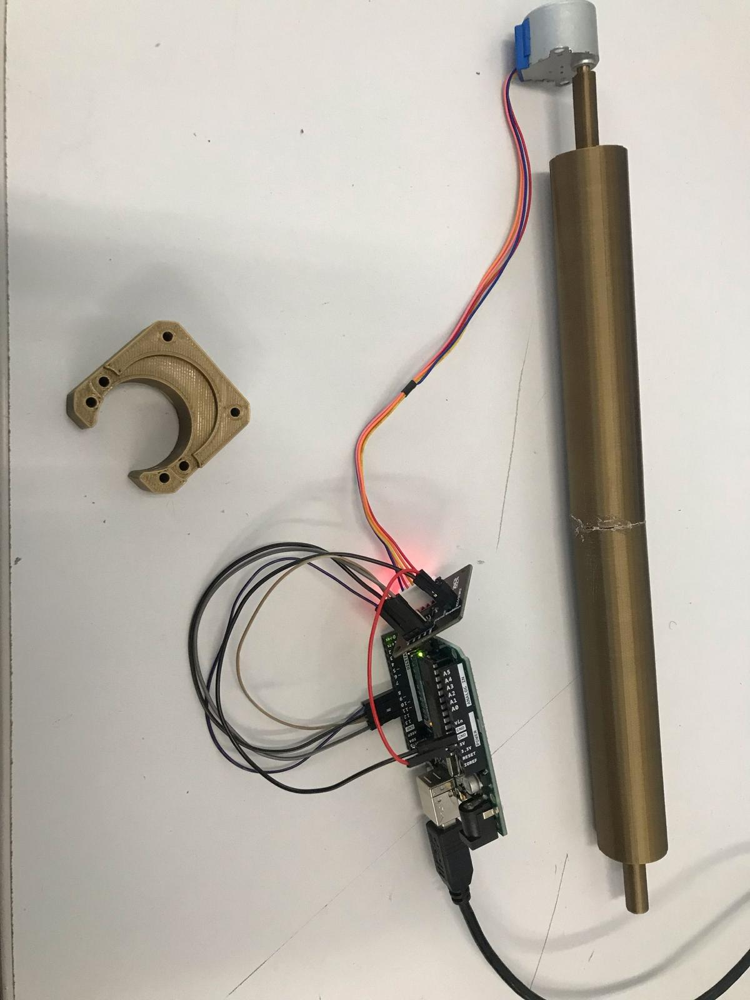
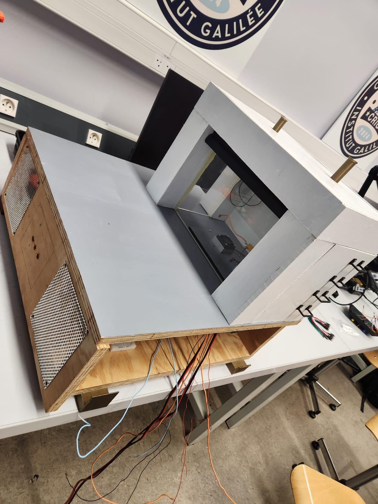
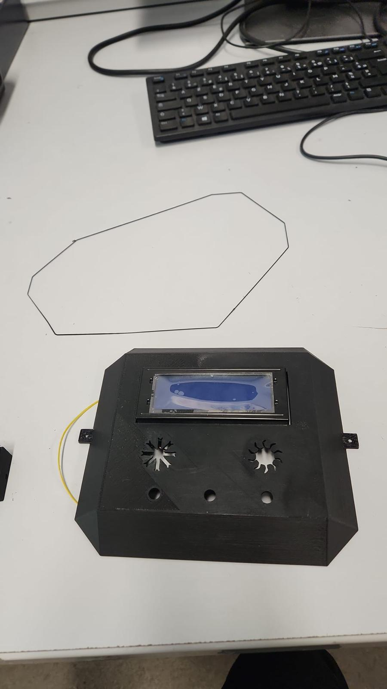
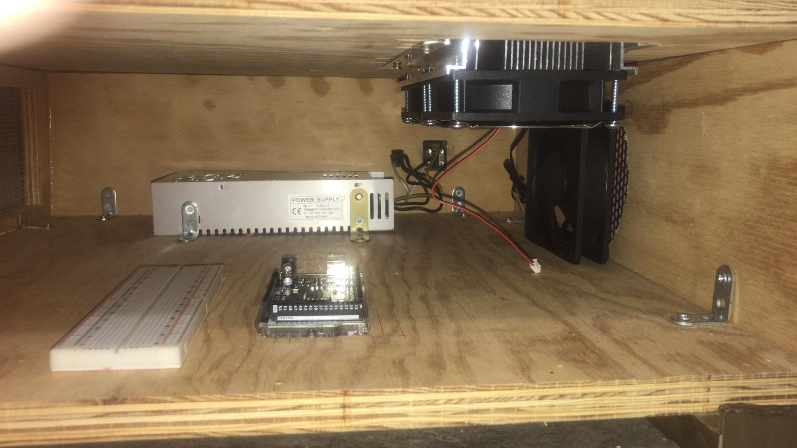

# Maison à basse consommation — maquette de régulation thermique

Maquette de démonstration d'une habitation sobre en énergie : une petite maison en bois dont la température intérieure est pilotée par une carte Arduino Mega, avec deux modes (hiver et été) qui simulent les conditions extérieures.


*Poster du projet. Il présente le contexte, le matériel, le montage électrique et la logique des modes été et hiver ; le reste de cette page complète ce qu'il ne dit pas.*

## En bref

- **Cadre** : projet d'instrumentation de deuxième année du cycle ingénieur, spécialité Instrumentation et Systèmes Embarqués, Sup Galilée (Université Sorbonne Paris Nord), année 2024–2025.
- **Équipe** : quatre étudiants, encadrés par un enseignant-chercheur.
- **Principe** : réguler la température intérieure entre 21 et 23 °C avec une résistance chauffante, un volet motorisé et des ventilateurs, face à un extérieur simulé par une lampe halogène (soleil) et un module Peltier (froid).
- **État** : maquette construite et câblée, composants testés un par un. La régulation complète n'a pas été validée par des essais.

## Ma contribution

Travail réalisé à quatre. D'après la répartition des tâches du rapport, j'ai pris en charge :

- le **volet roulant** : découpe, pose et programmation de sa commande par moteur pas à pas ;
- la pose du capteur de température et de la résistance chauffante ;
- une partie du câblage, de l'assemblage et de la peinture de la maison ;
- avec le reste du groupe, le programme général été/hiver.

La façade de contrôle, la lampe, le module Peltier, la conception 3D et l'asservissement de la résistance ont été menés par les autres membres.



*Enrouleur du volet entraîné par le moteur pas à pas, en test sur table.*

## Ce que fait le code de ce dépôt

Le poster décrit le fonctionnement visé. Le programme `Projet_Maison_Energetique.ino` en est la version d'intégration :

- lecture des boutons hiver et été, allumage de la LED correspondante ;
- commande en PWM de la résistance, de la lampe, du Peltier et des ventilateurs, avec des valeurs fixes selon le mode ;
- lecture du capteur TCN75A (I2C) et affichage de la température sur l'écran LCD et sur le port série ;
- descente puis remontée du volet par le moteur pas à pas ;
- une fonction de test par composant.

La régulation PID et l'ouverture du volet selon les seuils de 21 et 23 °C figurent sur le schéma bloc du poster, mais **ne sont pas implémentées dans cette version du code**.

Brochage relevé dans le code :

| Fonction | Broche |
|---|---|
| Module Peltier (PWM) | 12 |
| Résistance chauffante (PWM) | 11 |
| Lampe halogène (PWM) | 10 |
| Ventilateur (PWM) | 13 |
| Servomoteur de la lampe | 4 |
| Boutons hiver / été | 2 / 3 |
| LED hiver / été | 50 / 37 |
| Potentiomètre | A0 |
| Moteur pas à pas du volet | 32, 28, 30, 22 |
| Capteur TCN75A (0x48) et écran LCD (0x27) | bus I2C |

## Essais et résultats

- Chaque composant a été essayé séparément avec les croquis de test.
- **Aucune mesure de régulation en conditions réelles n'a été faite** : le montage électrique final a été terminé trop tard. Les tableaux de température du rapport sont des **données simulées**, produites pour illustrer le comportement attendu ; ils ne sont pas repris ici comme des résultats.
- Deux enseignements retenus par l'équipe : calculer les puissances dissipées avant de choisir les composants, et tester le montage sur table avant de le fixer dans la maquette.

## Installation

1. Installer l'IDE Arduino, puis les bibliothèques `LiquidCrystal I2C` et `CheapStepper`.
2. Ouvrir `arduino/Projet_Maison_Energetique/` ; les fichiers `TCN75A.h` et `TCN75A.cpp` doivent rester dans ce dossier.
3. Sélectionner la carte Arduino Mega et le port, puis téléverser.
4. Appuyer sur le bouton hiver ou été de la façade.

> La compilation et le téléversement n'ont pas été rejoués lors de la mise en forme de ce dépôt.

## Organisation du dépôt

```
arduino/Projet_Maison_Energetique/   Programme d'intégration et pilote du capteur TCN75A
arduino/peltier/                     Essai du module Peltier
arduino/moteur_pas_a_pas_test/       Essai du moteur pas à pas
arduino/stepper_turning/             Essai de rotation du moteur pas à pas
arduino/Test_temperature_sensor/     Essai du capteur de température
cad/                                 Fichiers Fusion 360 (enrouleur du volet, coffret)
assets/                              Poster, photos de la maquette et vues 3D
```

## La maquette en photos

| | |
|---|---|
|  |  |
| *La maison sur sa base* | *Façade de contrôle : écran, boutons, potentiomètre* |
|  |  |
| *Structure en bois en cours d'assemblage* | *Intérieur de la base : alimentation, ventilateur et carte* |

## Crédits et licence

Projet réalisé par un groupe de quatre étudiants de Sup Galilée. Aucune licence n'a été définie pour ce travail d'équipe.
